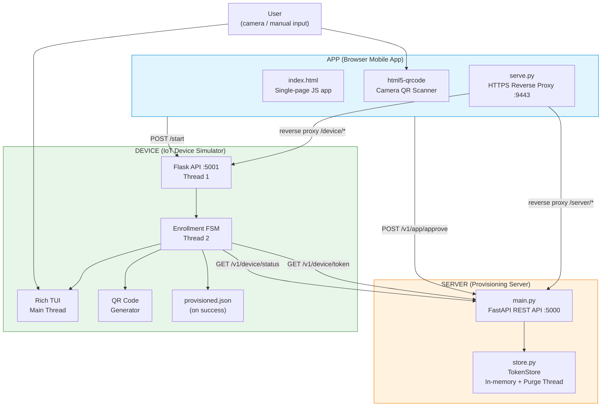

# System Components Diagram

```mermaid
graph TB
    subgraph App["APP (Browser Mobile App)"]
        direction TB
        index["index.html<br/>Single-page JS app"]
        scanner["html5-qrcode<br/>Camera QR Scanner"]
        serve["serve.py<br/>HTTPS Reverse Proxy :9443"]
    end

    subgraph Server["SERVER (Provisioning Server)"]
        direction TB
        fastapi["main.py<br/>FastAPI REST API :5000"]
        store["store.py<br/>TokenStore<br/>In-memory + Purge Thread"]
        fastapi --> store
    end

    subgraph Device["DEVICE (IoT Device Simulator)"]
        direction TB
        flask["Flask API :5001<br/>Thread 1"]
        enrollment["Enrollment FSM<br/>Thread 2"]
        tui["Rich TUI<br/>Main Thread"]
        qr["QR Code<br/>Generator"]
        storage["provisioned.json<br/>(on success)"]
        flask --> enrollment
        enrollment --> qr
        enrollment --> tui
        enrollment --> storage
    end

    %% App <-> Device
    App -- "POST /start" --> flask
    serve -- "reverse proxy /device/*" --> flask

    %% App <-> Server
    App -- "POST /v1/app/approve" --> fastapi
    serve -- "reverse proxy /server/*" --> fastapi

    %% Device <-> Server
    enrollment -- "GET /v1/device/token" --> fastapi
    enrollment -- "GET /v1/device/status" --> fastapi

    %% User interactions
    User["User<br/>(camera / manual input)"] --> scanner
    User --> tui

    style App fill:#e1f5fe,stroke:#0288d1
    style Server fill:#fff3e0,stroke:#f57c00
    style Device fill:#e8f5e9,stroke:#388e3c
```
