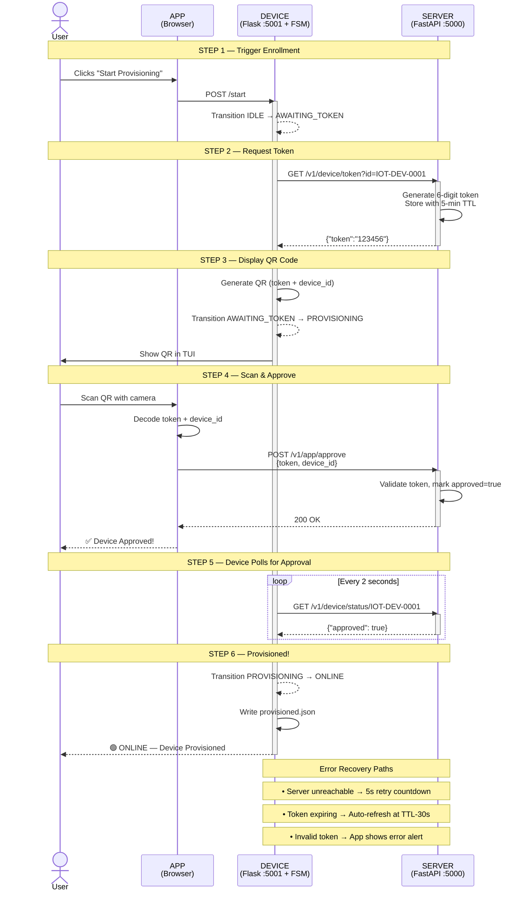

# Enrollment Workflow Diagram

```mermaid
sequenceDiagram
    actor User
    participant App as APP<br/>(Browser)
    participant Device as DEVICE<br/>(Flask :5001 + FSM)
    participant Server as SERVER<br/>(FastAPI :5000)

    Note over User,Server: STEP 1 — Trigger Enrollment

    User->>App: Clicks "Start Provisioning"
    App->>Device: POST /start
    activate Device
    Device-->>Device: Transition IDLE → AWAITING_TOKEN

    Note over User,Server: STEP 2 — Request Token

    Device->>Server: GET /v1/device/token?id=IOT-DEV-0001
    activate Server
    Server->>Server: Generate 6-digit token<br/>Store with 5-min TTL
    Server-->>Device: {"token":"123456"}
    deactivate Server

    Note over User,Server: STEP 3 — Display QR Code

    Device->>Device: Generate QR (token + device_id)
    Device-->>Device: Transition AWAITING_TOKEN → PROVISIONING
    Device->>User: Show QR in TUI

    Note over User,Server: STEP 4 — Scan & Approve

    User->>App: Scan QR with camera
    App->>App: Decode token + device_id
    App->>Server: POST /v1/app/approve<br/>{token, device_id}
    activate Server
    Server->>Server: Validate token, mark approved=true
    Server-->>App: 200 OK
    deactivate Server
    App-->>User: ✅ Device Approved!

    Note over User,Server: STEP 5 — Device Polls for Approval

    loop Every 2 seconds
        Device->>Server: GET /v1/device/status/IOT-DEV-0001
        activate Server
        Server-->>Device: {"approved": true}
        deactivate Server
    end

    Note over User,Server: STEP 6 — Provisioned!

    Device-->>Device: Transition PROVISIONING → ONLINE
    Device->>Device: Write provisioned.json
    Device-->>User: 🟢 ONLINE — Device Provisioned
    deactivate Device

    Note over Device,Server: Error Recovery Paths
    Note over Device,Server: • Server unreachable → 5s retry countdown
    Note over Device,Server: • Token expiring → Auto-refresh at TTL-30s
    Note over Device,Server: • Invalid token → App shows error alert
```
